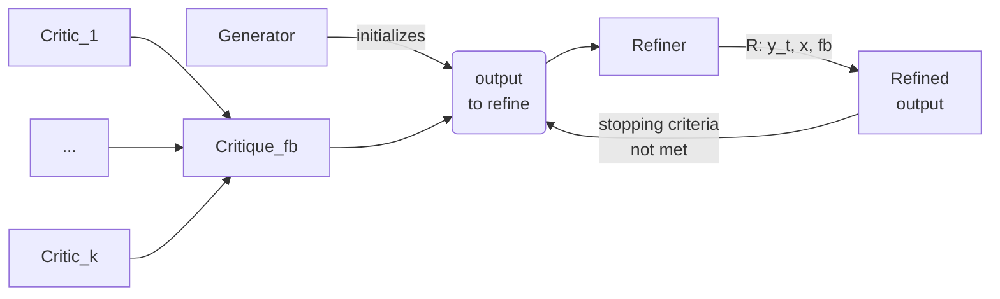

# Self-Refine: Iterative Refinement with Self-Feedback

_Can LLMs enhance their own output without our guidance? In some cases, yes! With Self-Refine, LLMs can generate feedback on their work, use it to improve the output, and repeat this process._


## [Website](https://selfrefine.info), [Paper](https://arxiv.org/pdf/2303.17651.pdf)


<hr>

## Setup

* We use prompt-lib for querying LLMs. You can install `prompt-lib` by running the following commands:

```sh
!git clone https://github.com/reasoning-machines/prompt-lib
!pip install prompt-lib/
```

Depending on your default settings, you may want to use the following to set a PYTHONPATH:

```sh
export PYTHONPATH=".:../:.:src:../:../../:.:prompt-lib"
```

## Getting Started with iterative acronym generation


```sh
python -u src/acronym/run.py "Using language models of code for few-shot commonsense"
```

* Since we sample with temperature 0.7, you'll get different results each time you run the above command.


```
0 INIT> Using language models of code for few-shot commonsense

0 GEN> CLoCK
0 SCORES> * Ease of pronunciation: CLoCK is pronounced "clah-k". This is easy acronym to pronounce. 4/5 
* Ease of spelling: CLoCK is easy to spell. 5/5 
* Relation to title: CLoCK stands for "Code Language Models of Commonsense Knowledge" which is related to the title. 5/5 
* Positive connotation: CLoCK is a positive acronym. It implies accuracy and efficiency. 5/5 
* Well-known: CLoCK is not a well-known acronym. 2/5

* Total score: 21/25

1 GEN> CMNSC
1 SCORES> * Ease of pronunciation: CMNSC is pronounced "see-min-es-see". This is a difficult acronym to pronounce. 1/5 
* Ease of spelling: CMNSC is difficult to spell. 1/5 
* Relation to title: CMNSC stands for "Commonsense" which is related to the title. 4/5 
* Positive connotation: CMNSC is a neutral acronym. 3/5 
* Well-known: CMNSC is not a well-known acronym. 1/5

* Total score: 10/25

2 GEN> COMMIT
2 SCORES> * Ease of pronunciation: COMMIT is pronounced "com-mit". This is an easy acronym to pronounce. 4/5
* Ease of spelling: COMMIT is easy to spell. 5/5
* Relation to title: COMMIT stands for "Commonsense Model of Code for Intuitive Training" which is related to the title. 5/5 
* Positive connotation: COMMIT is a positive acronym. It implies commitment and dedication. 5/5
* Well-known: COMMIT is not a well-known acronym. 2/5

* Total score: 21/25
```

<hr>


## Dialogue Response generation

```sh
PYTHONPATH="." python -u src/responsegen/run.py --output <OUTPUT FILE> --size <DATA SIZE>
```
Use size 0 for running on all test instances

<hr>


## Code Readability Improvement

```sh
PYTHONPATH="." python -u src/readability/readability.py --output <OUTPUT FILE>
```
Evaluation
```sh
PYTHONPATH="." python -u src/readability/{count_comment|count_function|count_meaningful_var}.py --file <INPUT FILE>
```


<hr>


## Commongen

* We use a hard version of commongen. The data is located in `data/prompts/commongen`. You can download the data by running the following commands:

```sh
python -u src/commongen/run.py cmd stair bubble team dryer puppy aliens cat 
```

<hr>


### General setup

* Each task has three different types of prompts:

1. Init prompt: used to initialize the task.
2. Feedback prompt: used to get feedback from the model on the intermediate results.
3. Iterate prompt: used to get the next iteration from the model, based on the feedback.

Every task has a `run.py` that initializes the prompts and runs the task.

* As an example, the prompts for commongen are as follows:

1. Init prompt:

```
python src/commongen/task_init.py
```

2. Feedback prompt:

```
 python src/commongen/feedback.py
```

3. Iterate prompt:

```
python src/commongen/task_iterate.py
```

You can also see these prompts on our [website](https://selfrefine.info).


## Citation

```
@misc{madaan2023selfrefine,
      title={Self-Refine: Iterative Refinement with Self-Feedback}, 
      author={Aman Madaan and Niket Tandon and Prakhar Gupta and Skyler Hallinan and Luyu Gao and Sarah Wiegreffe and Uri Alon and Nouha Dziri and Shrimai Prabhumoye and Yiming Yang and Sean Welleck and Bodhisattwa Prasad Majumder and Shashank Gupta and Amir Yazdanbakhsh and Peter Clark},
      year={2023},
      eprint={2303.17651},
      archivePrefix={arXiv},
      primaryClass={cs.CL}
}
```

